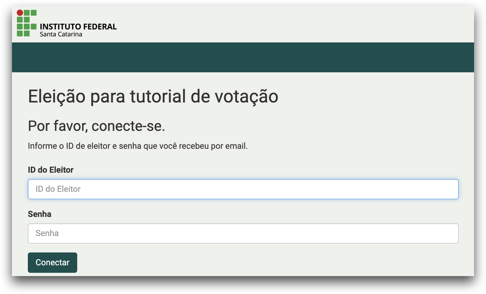

# Como votar usando o sistema de votação eletrônica

1. Para votar use as informações que recebeu por email (id do eleitor, senha e link da eleição).
    

2. A página inicial contém as instruções, clique no botão **Iniciar**
    

3. Escolha um dos candidatos e, se a eleição possuir mais de uma questão, clique no botão **Próxima Questão**. Senão, clique em **Próximo Passo**.
    - Se a eleição em que você estiver votando permitir selecionar mais de um candidato, selecione quantos forem necessários, de acordo com a configuração da eleição.

    

4. Nesta etapa é possível revisar as escolhas de voto e caso esteja tudo correto clique no botão **Depositar esta Cédula na Urna**.

    -   Se desejar alterar o voto, basta clicar no link **Editar Resposta(s)** e a tela retornará para a cédula de votação com todos os candidatos disponíveis para nova escolha.

    

7. Clique no botão **Confirmar** para depositar sua cédula na urna. Se não deseja depositar a cédula, clique no botão cancelar.
    

8. Parabéns, seu voto foi depositado com sucesso.
    

**Atenção:** O sistema Helios permite que você deposite cédulas na urna quantas vezes desejar. Porém, somente a última cédula depositada é a que será contabilizada na apuração da urna. Todas as cédulas anteriores serão descartadas.  